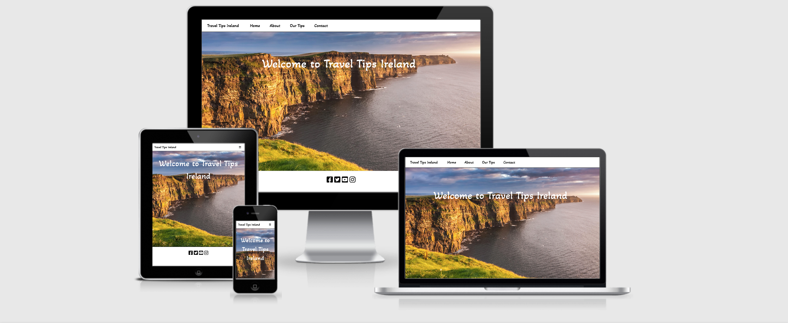
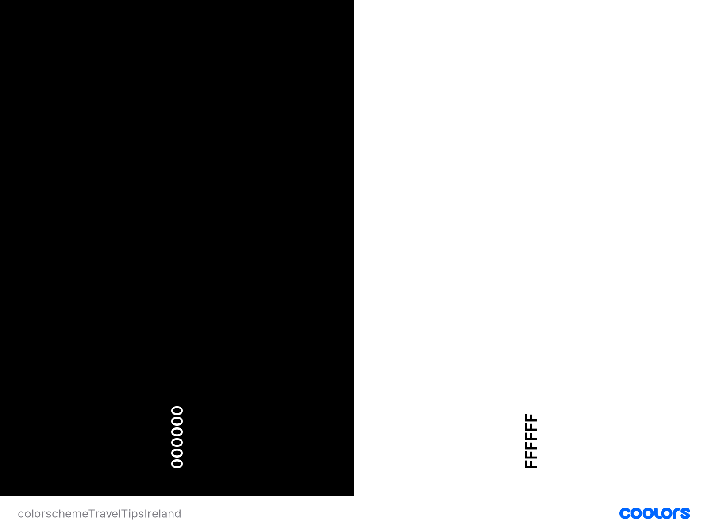

# Travel-Tips-Ireland

# Table of contents
- [User Experience](#user-experience)
  * [The project Goal](#the-project-goal)
- [User Goals](#user-goals)
- [User Stories](#user-stories)
- [Site Owner Goals](#site-owner-goals)
- [User Requirements and Expectations](#user-requirements-and-expectations)
  * [Requirements](#requirements)
  * [Expectations](#expectations)
- [Design Choices](#design-choices)
  * [Typography](#typography)
  * [Icons](#icons)
  * [Colours](#colours)
  * [Imagery](#imagery)
  * [Wireframes](#wireframes)
- [Features](#features)
- [Features left to implement](#features-left-to-implement)
- [Technologies](#technologies)
- [Testing](#testing)
- [Deployment](#deployment)
- [Credits](#credits)

# User Experience

## The project Goal  

The goal of this project is to make a top quality travel website with beautiful imagery of Ireland's tourist hot spots. The target market is specifically for people from outside of Ireland
wishing to travel too Ireland.

# User Goals

* As a user, I want to find contact details for the travel website.
* As a user, I want to find an about page where the user can read a brief description of Ireland.
* As a user, I want to find the travel destinations that the company are advertising.
* As a user, I want to find information about the particular destinations being advertised.
* As a user, I want to find nice imagery of the destinations.
* As a user, I want to find a map of Ireland to see where the destinations are located for people who are not aware of where the destinations are in Ireland.
* As a user, I want to find a contact form where they can contact the company about any questions they may have or have in the future.

# User Stories

* As a user, I want to visit a website that is easily viewable, easy to navigate around and simplified so I will be informed on the service that is on offer.
* As a user, I want to see if there are any holiday destinations that I would be interested in travelling too.
* As a user, I want to see an about page where I can read a brief description about Ireland.
* As a user, I want to see images of the destinations that the website are advertising.
* As a user, I want to be able to contact the site owner with any questions or doubts I may have now or in the future.

# Site Owner Goals

* As a site owner, I want to give users to the site a gateway to contact the site owner about any enquiries they may have.
* As a site owner, I want to give the users to the site an opportunity read information about the travel destinations on offer.
* As a site owner, I want to give users to the site the opportunity to see the imagery of the destinations being advertised.
* As a site owner, I want to give the user an opportunity to view a destination they are thinking of visiting to see that destination on google maps.
* As a site owner, I want to give users grow the company and keep users coming back to the website to book more holidays too Ireland in the future. 

# User Requirements and Expectations

## Requirements

* To navigate across the website with no problems on all pages and all nav-links to be working as their intended purpose.
* To be given a brief description of Ireland in the about page.
* All interactive features such as google maps, buttons and emailjs for the contact form to be working and operating with no erros or faults.
* All text to be easily readable on all devices and all imagery to not be stretched and easily viewable on all devices.

## Expectations

*  Navigation of the website is working appropriatley on all pages with all nav-links working as per their intended purpose.
*  Brief description of Ireland is given in the about page.
*  Interactive features of the website are all working with no faults or errors.
*  All text is easily viewable on all devices along with imagery with no stretching on any device.

# Design Choices

Hero images were inserted on each page of the website. I considered the profesional opinions of some software developers on hero images for each
page of the website to get their take on the design. Their opinions were that it would be a good design. I found that hero images provided 
great imagery of the beauty that Ireland has to offer. The hero images provides user to the website with a sense of captivation looking at 
the Cliffs of Moher on the home page, Dublin city at night in the about page,the Mourne mountains of County Down in the our tips page and 
the Rock of Cashel in the County Tipperary in the contact page. Consistency in design was important for the website. Every page has a footer,
navbar, hero image and same font-family. [Bootstrapcards](https://getbootstrap.com/docs/5.0/components/card/) was used as a tool
to display the holiday destinations for the user.

## typography

I imported [Google Fonts](https://getbootstrap.com/docs/5.0/components/card/) for the website. I used the font-family [Akaya Telivigala](https://fonts.google.com/?query=Akaya+Telivigala)
due to a personal liking to the font-family and found it as an attractive family for the text and heading content.

## Icons

Icons for the website were provided by [Font Awesome](https://fontawesome.com/). Icons gave an attractive styling for the footer element on each page of the website.
The Icons used included the social media networks for users to contact the site owner. The icons were Facebook, Twitter, Instagram and Youtube.

## Colours

The body, navbar and footer on each page has a background hex colour of #ffffff with its text and icon content being a hex color of #000000 
to give a nice contrast to the #ffffff background. I used [coolors](https://coolors.co/) to portray the colour scheme for the website.

## Imagery

Images below were taken from **google images** to style the website with imagery.

* [Home page image](https://github.com/markgordon22/Travel-Tips-Ireland/tree/main/assets/img/img-home).
* [About page images](https://github.com/markgordon22/Travel-Tips-Ireland/tree/main/assets/img/img-about).
* [Our Tips images](https://github.com/markgordon22/Travel-Tips-Ireland/tree/main/assets/img/img-ourtips).
* [Contact page image](https://github.com/markgordon22/Travel-Tips-Ireland/tree/main/assets/img/img-contact).

## Wireframes

Before using any Technologies for wireframing I started off with a pen paper to get a rough feel of what I wanted the website to look and 
feel. I spent roughly 2-3 days doing this. I then used [balsamiq](https://balsamiq.com/) to display the finished wireframes for the website.

 * [Home page](https://github.com/markgordon22/Travel-Tips-Ireland/blob/main/wireframes/homepage.pdf).
 * [About page](https://github.com/markgordon22/Travel-Tips-Ireland/blob/main/wireframes/aboutpage.pdf).
 * [Our Tips page](https://github.com/markgordon22/Travel-Tips-Ireland/blob/main/wireframes/ourtipspage.pdf).
 * [Contact page](https://github.com/markgordon22/Travel-Tips-Ireland/blob/main/wireframes/contactpage.pdf).

 # Features

 Features implemented for the website include the following.

 * Simple and easy navigation to geta round the site.
 * Consistent design.
 * Contact form for user to contact about potential travel plans.
 * Google map to show where travel destinations in the website are located.
 * Google place autocomplete search box for users to search for places in Ireland.
 * Images - hero images on each page displaying the beauty of Ireland and images of the travel tips for users to look at.
 * Bootstrap buttons where user clicks it and text will appear. 
 * Fully responsive on phone, tablet and desktop devices.

 # Features left to implement

 * None.

 # Technologies

 Technologies used

 Frontend

 Languages

* [HTML](https://en.wikipedia.org/wiki/HTML)
* [CSS](https://en.wikipedia.org/wiki/CSS)
* [Javascript](https://en.wikipedia.org/wiki/JavaScript)

Libraries and Frameworks

* [Bootstrap](https://getbootstrap.com/)
* [Font Awesome](https://fontawesome.com/icons)
* [Google Fonts](https://fonts.google.com/)
* [Fancybox](https://fancyapps.com/fancybox/3/)
* [Google Maps API](https://developers.google.com/maps/documentation) Used to create map and autocomplete search input
* [EmailJS](https://www.emailjs.com/docs/tutorial/creating-contact-form/) to create a contact form with template parameters

Tools 

* [Gitpod](https://www.gitpod.io/) for working on my code
* [Git](https://git-scm.com/) for version control
* [Github](https://en.wikipedia.org/wiki/GitHub) hosting files and for deploying website github pages
* [Balsamiq](https://balsamiq.com/) to do wireframes for repsective devices
* [Tinypng](https://tinypng.com/) to compress and reduce file size
* [Autoprefixer](https://autoprefixer.github.io/) to add vendor prefixes to css
* [HTML freeformatter](https://www.freeformatter.com/html-formatter.html) to beautify html code
* [HTML validator](https://validator.w3.org/) testing validator for html code
* [CSS validator](https://validator.w3.org/) testing validator for css code
* [JavaScript linter](https://jshint.com/) testing validator for javascript code
* [Markdown](https://docs.github.com/en/github/writing-on-github/basic-writing-and-formatting-syntax) help with links to images,content,wireframes and code sources used.
*  Chrome dev tools to detect bugs in the code.
* [Am I Responsive](http://ami.responsivedesign.is/) Used to create a mockup of website.
* [GitHub Wiki TOC generator](https://ecotrust-canada.github.io/markdown-toc/) to generate own MarkDown TOC online.

# Testing

# Deployment

# Credits

 

