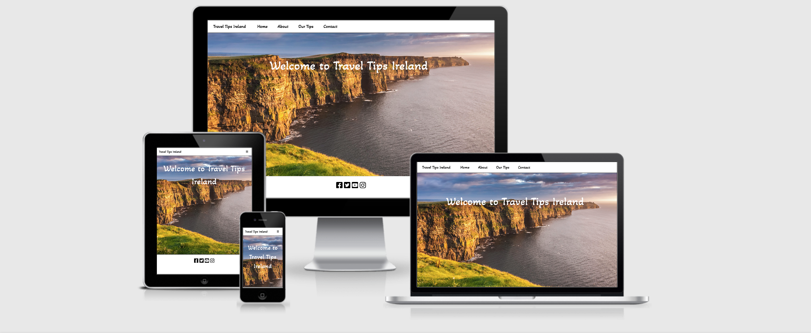
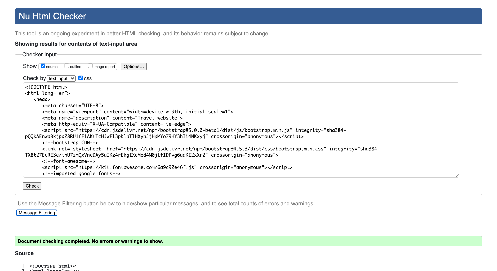
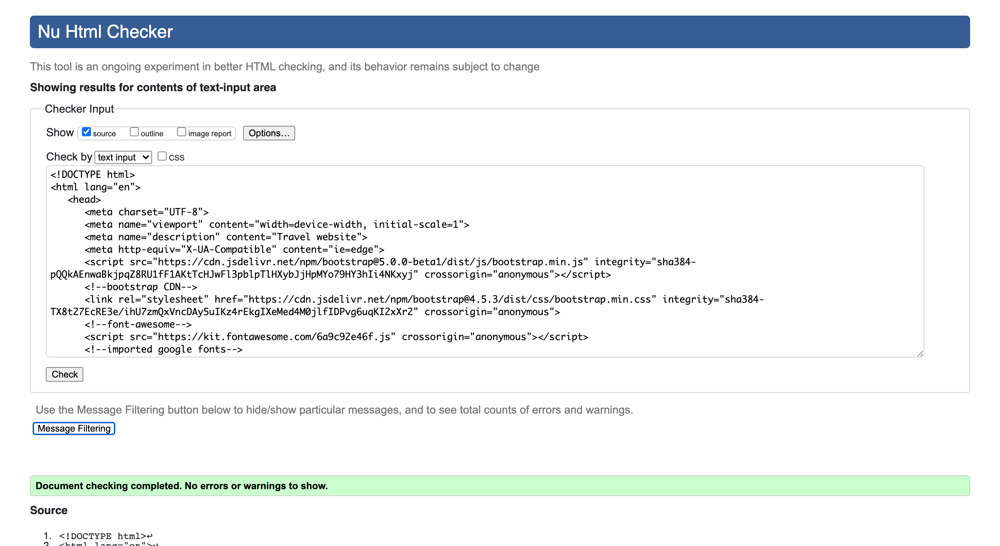
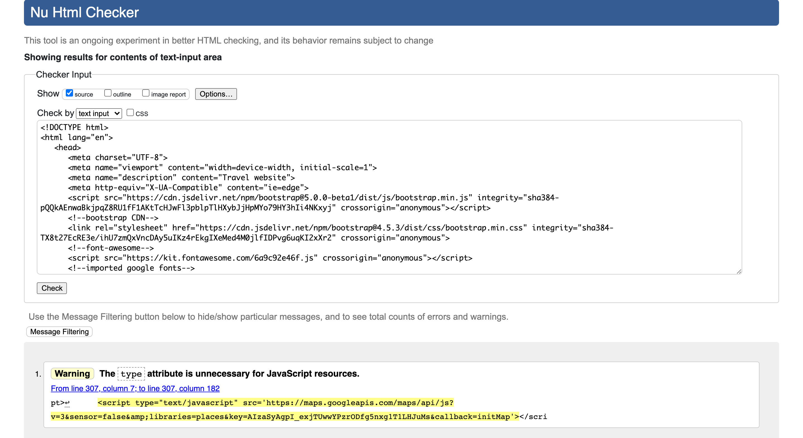
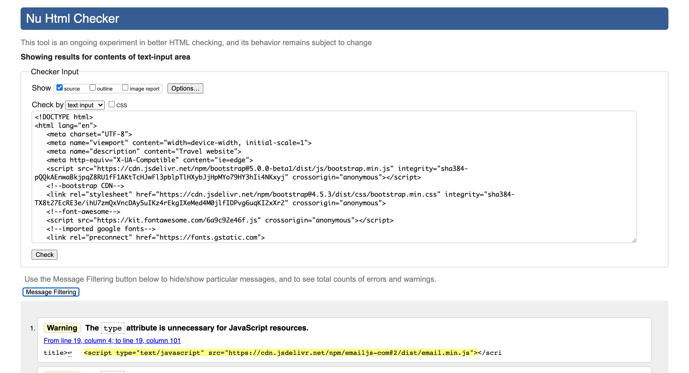
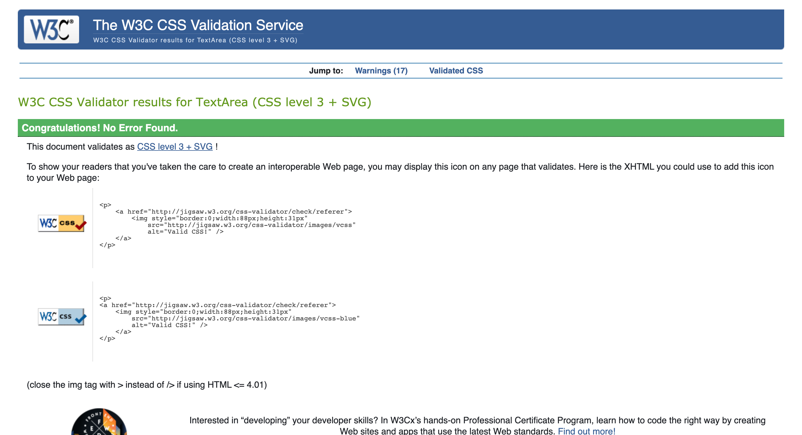
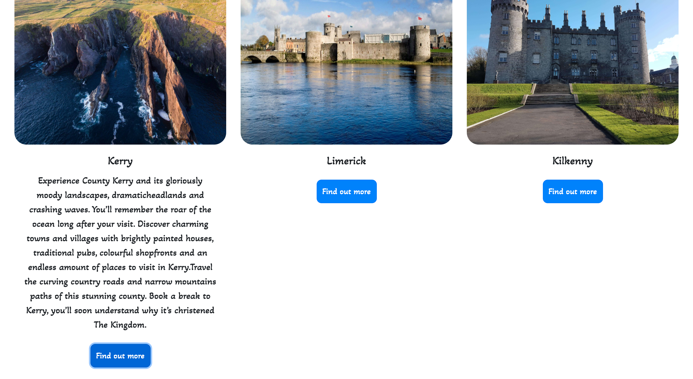

# Travel Tips Ireland

# Table of contents
- [User Experience](#user-experience)
  * [The project Goal](#the-project-goal)
- [User Goals](#user-goals)
- [User Stories](#user-stories)
- [Site Owner Goals](#site-owner-goals)
- [User Requirements and Expectations](#user-requirements-and-expectations)
  * [Requirements](#requirements)
  * [Expectations](#expectations)
- [Design Choices](#design-choices)
  * [Typography](#typography)
  * [Icons](#icons)
  * [Colours](#colours)
  * [Imagery](#imagery)
  * [Wireframes](#wireframes)
- [Features](#features)
- [Features left to implement](#features-left-to-implement)
- [Technologies](#technologies)
- [Testing](#testing)
  * [Lighthouse Testing](#lighthouse-testing)
  * [Bugs](#bugs)
- [Deployment](#deployment)
- [Credits](#credits)
  * [Code](#code)
  * [Content](#content)
  * [Hero images](#hero-images)
  * [About pages](#about-pages)
  

# User Experience

## The project Goal  

The goal of this project is to make a top quality travel website with beautiful imagery of places in Ireland. The target market is specifically for people from outside of Ireland
wishing to travel too Ireland at some point in the future.

# User Goals

* As a user, I want to find contact details for the travel website.
* As a user, I want to find an about page where the user can read a brief description of Ireland.
* As a user, I want to find the travel destinations that the company are advertising.
* As a user, I want to find information about the particular destinations being advertised.
* As a user, I want to find nice imagery of the destinations.
* As a user, I want to find a map of Ireland to see where the destinations are located for people who are not aware of where the destinations are in Ireland.
* As a user, I want to find a contact form where they can contact the company about any questions they may have or have in the future.

# User Stories

* As a user, I want to visit a website that is easily viewable, easy to navigate around and simplified so I will be informed on the service that is on offer.
* As a user, I want to read about the holiday destinations that I might be interested in travelling too.
* As a user, I want to see an about page where I can read about Ireland.
* As a user, I want to see images of the destinations that the website are advertising.
* As a user, I want to be able to contact the site owner with any questions or doubts I may have now or in the future.
* As a user, I want to see a map of Ireland to see where the destinations are located.

# Site Owner Goals

* As a site owner, I want to give users to the site a gateway to contact the site owner about any enquiries they may have.
* As a site owner, I want to give the users to the site an opportunity read information about the travel destinations on offer.
* As a site owner, I want to give users to the site the opportunity to see the images of the destinations being advertised.
* As a site owner, I want to give the user an opportunity to view a destination they are thinking of visiting, to see that destination on google maps.
* As a site owner, I want to grow the company and keep users coming back to the website to book more holidays too Ireland in the future. 
* As a site owner, I want to give the user a chance to read about Ireland in the about page.

# User Requirements and Expectations

## Requirements

* To navigate across the website with no problems on all pages and all nav-links to be working as their intended purpose.
* To be given a brief description of Ireland in the about page.
* All interactive features such as google maps, buttons and emailjs for the contact form to be working and operating with no erros or faults.
* All text to be easily readable on all devices and all imagery to not be stretched and easily viewable on all devices.

## Expectations

*  Navigation of the website is working appropriatley on all pages with all nav-links working as per their intended purpose.
*  Brief description of Ireland is given in the about page.
*  Interactive features of the website are all working with no faults or errors.
*  All text is easily viewable on all devices along with imagery with no stretching on any device.

# Design Choices

Hero images were inserted on each page of the website. I considered the profesional opinions of some software developers on hero images for each
page of the website to get their take on the design. Their opinions were that it would be a good design. I found that hero images provided 
great imagery of the beauty that Ireland has to offer. The hero images provides user to the website with a sense of captivation looking at 
the Cliffs of Moher on the home page, Dublin city at night in the about page,the Mourne mountains of County Down in the our tips page and 
the Rock of Cashel in the County Tipperary in the contact page. Consistency in design was important for the website. Every page has a footer,
navbar, hero image and same font-family. [Bootstrapcards](https://getbootstrap.com/docs/5.0/components/card/) was used as a tool
to display the holiday destinations for the user.

## typography

I imported [Google Fonts](https://getbootstrap.com/docs/5.0/components/card/) for the website. I used the font-family [Akaya Telivigala](https://fonts.google.com/?query=Akaya+Telivigala)
due to a personal liking to the font-family and found it as an attractive family for the text and heading content.

## Icons

Icons for the website were provided by [Font Awesome](https://fontawesome.com/). Icons gave an attractive styling for the footer element on each page of the website.
The Icons used included the social media networks for users to contact the site owner. The icons were Facebook, Twitter, Instagram and Youtube.

## Colours

The body, navbar and footer on each page has a background hex colour of #ffffff with its text and icon content being a hex color of #000000 
to give a nice contrast to the #ffffff background. I used [coolors](https://coolors.co/) to portray the colour scheme for the website.

## Imagery

Images below were taken from **google images** to style the website with imagery.

* [Home page image](https://github.com/markgordon22/Travel-Tips-Ireland/tree/main/assets/img/img-home).
* [About page images](https://github.com/markgordon22/Travel-Tips-Ireland/tree/main/assets/img/img-about).
* [Our Tips images](https://github.com/markgordon22/Travel-Tips-Ireland/tree/main/assets/img/img-ourtips).
* [Contact page image](https://github.com/markgordon22/Travel-Tips-Ireland/tree/main/assets/img/img-contact).

## Wireframes

Before using any Technologies for wireframing I started off with a pen paper to get a rough feel of what I wanted the website to look and 
feel. I spent roughly 2-3 days doing this. I then used [balsamiq](https://balsamiq.com/) to display the finished wireframes for the website.

I made wireframes which I believe equated to good user experiences and expectations. All pages have a simple design and is easy to follow which made
me think that these were suitable platforms for me to sart building the website. Wireframes are linked below. Wireframes
for 2 out of the 4 pages import bootstrap cards as it provided a way of displaying an image with a title followed by text in an easy to follow fashion
for every user. This was a nice and convenient way of advertising the travel destinations.

 * [Home page](https://github.com/markgordon22/Travel-Tips-Ireland/blob/main/wireframes/homepage.pdf).
 * [About page](https://github.com/markgordon22/Travel-Tips-Ireland/blob/main/wireframes/aboutpage.pdf).
 * [Our Tips page](https://github.com/markgordon22/Travel-Tips-Ireland/blob/main/wireframes/ourtipspage.pdf).
 * [Contact page](https://github.com/markgordon22/Travel-Tips-Ireland/blob/main/wireframes/contactpage.pdf).

 # Features

 Features implemented for the website include the following.

 * Simple and easy navigation to geta round the site.
 * Consistent design.
 * Contact form for user to contact about potential travel plans.
 * Google map to show where travel destinations in the website are located.
 * Google place autocomplete search box for users to search for places in Ireland.
 * Images - hero images on each page displaying the beauty of Ireland and images of the travel tips for users to look at.
 * Bootstrap buttons where user clicks it and text will appear. 
 * Fully responsive on phone, tablet and desktop devices.

 # Features left to implement

 * None.

 # Technologies

 Technologies used

 Frontend

 Languages

* [HTML](https://en.wikipedia.org/wiki/HTML)
* [CSS](https://en.wikipedia.org/wiki/CSS)
* [Javascript](https://en.wikipedia.org/wiki/JavaScript)

Libraries and Frameworks

* [Bootstrap](https://getbootstrap.com/)
* [Font Awesome](https://fontawesome.com/icons)
* [Google Fonts](https://fonts.google.com/)
* [Google Maps API](https://developers.google.com/maps/documentation) Used to create map and autocomplete search input
* [EmailJS](https://www.emailjs.com/docs/tutorial/creating-contact-form/) to create a contact form with template parameters

Tools 

* [Gitpod](https://www.gitpod.io/) for working on my code
* [Git](https://git-scm.com/) for version control
* [Github](https://en.wikipedia.org/wiki/GitHub) hosting files and for deploying website github pages
* [Balsamiq](https://balsamiq.com/) to do wireframes for repsective devices
* [Tinypng](https://tinypng.com/) to compress and reduce file size
* [Autoprefixer](https://autoprefixer.github.io/) to add vendor prefixes to css
* [HTML freeformatter](https://www.freeformatter.com/html-formatter.html) to beautify html code
* [HTML validator](https://validator.w3.org/) testing validator for html code
* [CSS validator](https://validator.w3.org/) testing validator for css code
* [JavaScript linter](https://jshint.com/) testing validator for javascript code
* [Markdown](https://docs.github.com/en/github/writing-on-github/basic-writing-and-formatting-syntax) help with links to images,content,wireframes and code sources used.
*  Chrome dev tools to detect bugs in the code.
* [Am I Responsive](http://ami.responsivedesign.is/) Used to create a mockup of website.
* [GitHub Wiki TOC generator](https://ecotrust-canada.github.io/markdown-toc/) to generate own MarkDown TOC online.

# Testing

I tested the website over the course of its development. I did this manually by inspecting the look of the website on all devices provided by chrome.
This was a great way to debug the code and pinpointing why the website was not looking at its optimum to provide better user experiences. Family and friends were frequent judges of the 
look and feel of the website to get a taste of users likeability with the website. At the begining of the website I was focused on getting it up and running
on phone and other small devices and working my way up to tablets and desktop.

## Lighthouse testing

Lighthouse was used in Chrome developer tools to measure the performance, seo, accessibility and best practices of the website
The only main issue with the lighthouse testing was the performance score of the Our Tips page.

* [Home page desktop testing](https://github.com/markgordon22/Travel-Tips-Ireland/blob/main/testing/homepagedesktoptesting.pdf)
* [Home page mobile testing](https://github.com/markgordon22/Travel-Tips-Ireland/blob/main/testing/homepagemobiletesting.pdf)
* [About page desktop testing](https://github.com/markgordon22/Travel-Tips-Ireland/blob/main/testing/aboutpagedesktoptesting.pdf)
* [About page mobile testing](https://github.com/markgordon22/Travel-Tips-Ireland/blob/main/testing/aboutpagemobiletesting.pdf)
* [Our Tips page desktop testing](https://github.com/markgordon22/Travel-Tips-Ireland/blob/main/testing/ourtipspagedesktoptesting.pdf)
* [Our Tips page mobile testing](https://github.com/markgordon22/Travel-Tips-Ireland/blob/main/testing/ourtipspagemobiletesting.pdf)
* [Contact page desktop testing](https://github.com/markgordon22/Travel-Tips-Ireland/blob/main/testing/contactpagedesktoptesting.pdf)
* [Contact page mobile testing](https://github.com/markgordon22/Travel-Tips-Ireland/blob/main/testing/contactpagemobiletesting.pdf)

## Bugs

Over the duration of the development of the website came its bugs. The bugs encountered with its solution is outlined below.

Bug 1. Hero image on the home page had a slight margin to the left of the screen.
Solution: removed Bootstrap container class above the hero image.

Bug 2. Border-top of the footer element along with social media icons on the Our Tips page were positioned to the 
far left of the screen rather than in the middle where it was intended.
Solution: Row class above was missing a closing div element to rap the row

Bug 3. Only myself could fill out the form made by [EmailJS](https://www.emailjs.com/docs/tutorial/creating-contact-form/) and receive an email. I set the default email address to myself in Emailjs.
Solution: Went to my Email Template and set the To Email(in the top right corner of the template) to {{ To }} so that anybody who comes to complete the contact form will receive an email.

Bug 4. When user completes contact form successfully the page did not refresh after the user clicked the ok button below where it says
email was sent successfully.
Solution: I found a line of code on [w3schools](https://www.w3schools.com/jsref/met_loc_reload.asp) where it reloads the page after user clicks the ok button
when email is sent.

Bug 5. Heroimage on the home page was originally was an image of the Cliffs of Moher during with bright sky which made heading not readable.
Solution: replaced image of the Cliffs of Moher with a less brighter sky so that the title can be easily read by visitors to the site.

Bug 6. Contact page has a beautiful image of the Rock of Cashel which was being blocked by the send message button.
Solution: Increased the size of the hero image so that the user can see the castle entirely.

## Functionality Testing

**Home page**
  
* Nav links and navbar are operating well when trying to navigate different to parts of the website.
* Social media icons in the footer element are also operating well if user wishes to contact site owner

**About page**

* Nav links and navbar are operating well when trying to navigate to different parts of the website.
* Social media icons in the footer are also operating well if user wants to contact site owner.

**Our Tips page**

* Nav links and navbar are operating well when trying to navigate to parts of the website.
* Social media icons in the footer are also operating well.
* Google map is displaying markers with address and title of the marker displayed to the user. Map consists of easy
scrolling and shows all markers with the correct longitudes and latitudes of the respective holiday destinations
being advertised on the website. User can only able to search for places in Ireland and Great Britain in the autocomplete. Great
Britain must be included in the autocomplete as Belfast and Derry are both part of the gb country component restricition.
* User can click Bootstrap buttons under the card images to read about a destination in Ireland if they want to find out
 more about that destination.

**Contact page**

* Nav links and navbar are operating well when wanting to navigate to different parts of the website.
* Social media icons in the footer are also operating well if user wants to contact site owner.
* User can only complete form once they have filled in the respective inputs. This is done with the of the class="form-control"
* User once successfully completing the form they receive an email thanking them for choosing Travel Tips Ireland. User gets a
a structured email sent that is made with EmailJS templates.
* Page refreshes successfully once user clicks ok button in the modal.

## Responsiveness Testing

I tested the responsiveness of the website with the use of devices in the chrome developer tools. 
They included the following outlined below.

* Moto G4 - Successful
* Iphone 4 - Successful
* Galaxy s5 - Successful
* Pixel 2 - Successful
* Pixel 2 XL - Successful
* Iphone 5/SE - Successful
* Iphone 6/7/8 - Successful
* Iphone 6/7/8 plus - Successful
* Iphone X - Successful
* Ipad - Successful
* Ipad pro - Successful
* Surface Duo - Successful
* Galaxy fold - Successful

Desktop responsiveness - successful

**Usability Testing**

I Shared the website with friends, family and mentor who broke down a couple of things that could be improved on. It was
mainly the stretching of certain images on the Our Tips page and the lack of responsiveness to the button on the 
home page on a number of smaller devices which ultimately made me decide to remove it from the website. 
Usability was tested on phone, tablet and desktop devices. Lighthouse was used in the assistance of combating these issues.

HTML Validator from [HTML validator](testing/ourtipspagehtmlvalidator.png)

**Home page**

No errors

**About page**

No errors

**Our Tips page**

No errors

**Contact page**

No errors

CSS validator from [CSS Validator](https://jigsaw.w3.org/css-validator/)

**CSS stylesheet in the assets folder**

No errors

Javascript validator from [JS Hint](https://jshint.com/)

**Javascript folder in the assets folder**

## Compatability Testing

| Compatability tests                         | Chrome | Firefox | Edge |
| --------------------------------------------| ------ | ------- | ---- |
| Is website comptabile on these browsers?     |   Yes  |    Yes |  Yes   |

## Testing User Stories

1. As a user, I want to visit a website that is easily viewable, easy to navigate around and simplified so I will be informed on the service that is on offer.

User is looking at a website that is simplified, easily viewable with a nice hero image, is easy to navigate around with the use of the
Bootstrap navbar and nav links to go too different pages on the website.

2. As a user, I want to read about the holiday destinations that I might be interested in travelling too.

# Deployment

# Credits

## Code

* [Bootstrap](https://getbootstrap.com/) used to to make buttons and cards to display holiday destinations
* [Google Places](https://developers.google.com/maps/documentation/places/web-service/autocomplete) to allow user to search for destinations in Ireland
* [W3 Schools](https://www.w3schools.com/jsref/met_loc_reload.asp)received the code window.reload() in order to refresh the page when form is completed
* [Email JS](https://www.emailjs.com/docs/tutorial/creating-contact-form/) used to help create the form and email user will recieve when they successfully complete the form
* [Youtube](https://www.youtube.com/watch?v=x7Ewtay0Q78&t=517s) Tutorial on emailjs and the parameters it uses.

## Content

* [Dublin content](https://www.visitdublin.com/what-dublin-is-made-of)
* [Belfast content](https://www.visitbritain.com/gb/en/northern-ireland/belfast)
* [Sligo content](https://www.discoverireland.ie/sligo/things-to-do-in-sligo)
* [Athlone content](https://www.theprinceofwales.ie/local-attractions/)
* [Derry content](https://derrychoirfest.com/visiting/)
* [Cork content](https://www.cork-guide.ie/places-to-visit-in-cork.html)
* [Limerick content](https://www.limerickadventures.com/things-to-do-in-limerick-city/)
* [Donegal content](https://passionpassport.com/a-guide-to-visiting-donegal-ireland/)
* [Galway content](https://visitgalway.ie/)
* [Waterford content](https://visitwaterford.com/)
* [kerry content](https://www.discoverireland.ie/kerry)
* [Kilkenny content](https://visitkilkenny.ie/)

## Hero images

* [home page hero image](https://lp-cms-production.imgix.net/2019-06/479710035_high.jpg)
* [About page hero image](https://gaietyschool.com/wp-content/uploads/2019/04/main_banner_1.jpg)
* [Our tips hero image](http://static1.squarespace.com/static/545cddf9e4b00403fdcff4eb/58c99a7f86e6c07b2ffc7a00/5ae89852aa4a99ef2fbb1ada/1570353615545/?format=1500w)
* [Contact page hero image](https://i.pinimg.com/originals/5a/f7/ed/5af7ed231a30a8615f9d2320d370456c.jpg)

## About pages

* [Street image](https://www.fiverr.com/cupantae/take-a-photo-of-any-public-place-in-dublin-city)
* [Irish people image](https://veramenditx.com/2019/03/st-patricks-day-new-braunfels-2019/)
* [Coins image](https://www.barrons.com/articles/loose-change-and-the-unanticipated-side-effects-of-covid-19-51594901060)

## Our Tips images

* [Belfast](https://meetbelfast.com/plan-your-conference/support-services/)
* [Kilkenny](https://jrnyon.com/tours/48?category=selfdrive)
* [Athlone](https://ie.linkedin.com/company/bloomfield-house-hotel-leisure-club-and-spa)
* [Dublin](https://line.17qq.com/articles/oefegefz.html)
* [Galway](https://acpgroup.ie/)
* [Donegal](https://www.pinterest.es/pin/637681628463519461/)
* [Derry](https://www.belfasttelegraph.co.uk/business/northern-ireland/cross-border-boost-for-londonderrys-foyleside-centre-37649702.html)
* [Limerick](https://www.discoverireland.ie/limerick/king-john-s-castle)
* [Waterford](https://www.discoverireland.ie/waterford/things-to-do)
* [Cork](https://www.corkchoral.ie/about/festival-venues/clayton/)
* [Kerry](https://www.discoverireland.ie/wild-atlantic-way/things-to-do)
* [Sligo](https://www.discoverireland.ie/wild-atlantic-way/things-to-do)

 

